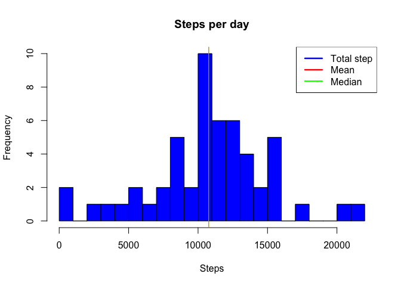
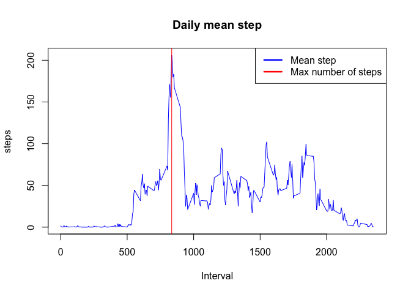
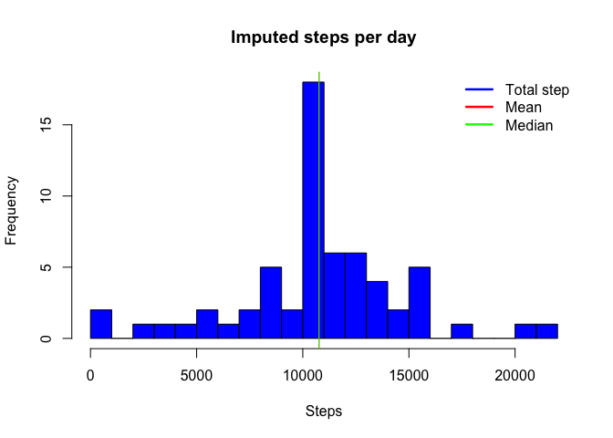
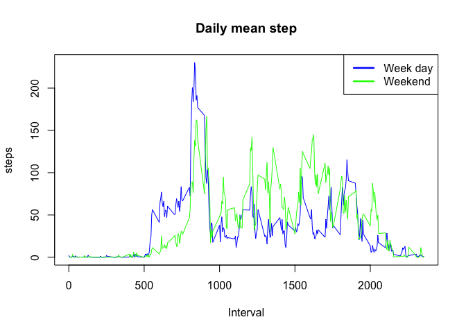

# Reproducible Research: Peer Assessment 1


```r
library(statsr)
library(dplyr)
```

```
## 
## Attaching package: 'dplyr'
```

```
## The following objects are masked from 'package:stats':
## 
##     filter, lag
```

```
## The following objects are masked from 'package:base':
## 
##     intersect, setdiff, setequal, union
```

```r
library(ggplot2)
```


## Loading and preprocessing the data

```r
# Get dataset
file_name <- 'activity'
zip_file <- paste0(file_name, '.zip')
if(!file.exists(zip_file))
    download.file('https://d396qusza40orc.cloudfront.net/repdata%2Fdata%2Factivity.zip', zip_file)
data <- read.csv(unz(zip_file, paste0(file_name, '.csv')), na.strings = 'NA')
data$date <- as.Date(data$date, format = '%Y-%m-%d') # convert into date
```


## What is mean total number of steps taken per day?


```r
steps_day <- aggregate(steps ~ date, data, sum)
with(steps_day, {
  hist(steps, breaks = 20, main = 'Steps per day', xlab = 'Steps', col = 'blue')
  abline(v = mean(steps_day$steps, na.rm = T), col = 'red')
  abline(v = median(steps_day$steps, na.rm = T), col = 'green')
  legend('topright', lwd = 2.5, col = c('blue', 'red', 'green'), legend = c('Total step', 'Mean', 'Median'))
})
```

<!-- -->


  
The mean number of steps taken each day is 10766.  
The median number of steps taken each day is 10765.

The mean value is pretty close to the median. That mean we don't have many outliers values.

## What is the average daily activity pattern?


```r
steps_interval <- aggregate(steps ~ interval, data, mean)
with(steps_interval, {
  plot(interval, steps, type = 'l', main = 'Daily mean step', xlab = 'Interval', col = 'blue')
  abline(v = interval[which.max(steps)], col = 'red')
  legend('topright', lwd = 2.5, col = c('blue', 'red'), legend = c('Mean step', 'Max number of steps'))
})
```

<!-- -->

The max number of steps occurs on interval 835

## Imputing missing values

```r
step_row_total <- nrow(data)
step_row_na <- nrow(data[is.na(data$steps), ])
step_row_positive <- nrow(data[data$steps > 0, ])
```

13.11 % of the dataset rows doesn't have *steps* values (2304 / 17568)  
We can also notice that only 37.31 % of the dataset rows contains positive *steps* values (6554 / 17568)  

Considering how close the median and the mean are, we can fairly consider the mean as a strong replacement for the missing values.

```r
data_imputed <- merge(data, steps_interval, by.x = 'interval', by.y = 'interval')
data_imputed$steps <- with(data_imputed, ifelse(is.na(steps.x), steps.y, steps.x))
data_imputed <- data_imputed[, c('date', 'interval', 'steps')]
```


```r
with(steps_day, {
  hist(steps, breaks = 20, main = 'Steps per day', xlab = 'Steps', col = 'blue')
  abline(v = mean(steps_day$steps, na.rm = T), col = 'red')
  abline(v = median(steps_day$steps, na.rm = T), col = 'green')
  legend('topright', lwd = 2.5, col = c('blue', 'red', 'green'), legend = c('Total step', 'Mean', 'Median'), bty = 'n')
})
```

<!-- -->

```r
steps_day_imputed <- aggregate(steps ~ date, data_imputed, sum)
with(steps_day_imputed, {
  hist(steps, breaks = 20, main = 'Imputed steps per day', xlab = 'Steps', col = 'blue')
  abline(v = mean(steps_day$steps, na.rm = T), col = 'red')
  abline(v = median(steps_day$steps, na.rm = T), col = 'green')
  legend('topright', lwd = 2.5, col = c('blue', 'red', 'green'), legend = c('Total step', 'Mean', 'Median'), bty = 'n')
})
```

<!-- -->

## Are there differences in activity patterns between weekdays and weekends?

A **day_type** column is added to the data set. Then This new factor is used to draw 2 lines in the *Daily mean step* chart. One for the weekday steps per interval, and the other one for the weelend steps per interval.


```r
data_imputed$day_type <- factor(as.POSIXlt(data_imputed$date)$wday %in% 1:5, labels = c('weekend', 'weekday'))
steps_interval <- aggregate(steps ~ day_type + interval, data_imputed, mean)
with(subset(steps_interval, day_type == 'weekday'), plot(interval, steps, type = 'l', main = 'Daily mean step', xlab = 'Interval', col = 'blue'))
with(subset(steps_interval, day_type == 'weekend'), lines(interval, steps, col = 'green'))
legend('topright', lwd = 2.5, col = c('blue', 'green'), legend = c('Week day', 'Weekend'))
```

<!-- -->

We can notice a shift the increasement starting interval during the weekend. We also have a highter rate a in the average daily number of steps occuring during the weekend.
